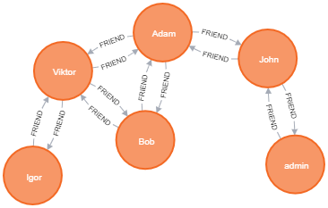

## Neo4j

#### Supports:
 - Adding a new node (Person)
 - Removing a node (Person)
 - Adding ralationships (Friends)
 - Removing relationships (Frends)
 - Displaying the connection length in a profile

## MongoDB

#### Supports:
 - Registering
 - Authenticating 
 - Viewing posts
 - Like/dislike posts
 - Adding new posts
 - Commenting posts
 - Viewing your profile
 - Viewing users profile by clicking on them through posts/comments
 - Updating information in your profile (except email as it is id field), new info will be synced with old comments/posts
 - Viewing users
 - Add/remove users to the friend list

## Dumps located at ./res folder
 - users - mongo users
 - posts - mongo posts
 - dump.json - neo4j persons
 - graph.png - neo4j graph image
 
## Application consist of pages:
  - Registration
  - Login
  - Home page - posts wall
  - Profile page
  - Users page
